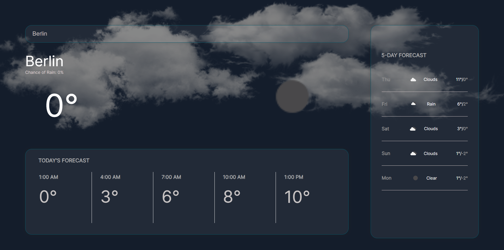

<h1>Weather App Project</h1>
  <h3>About the project</h3>
  
WeatherBy is a user-friendly weather application that delivers real-time weather updates. Users can effortlessly check the current weather, 5-day forecast, and more.

Live Demo: <a href='https://weatherby.vercel.app/'>Weatherby</a>  
» Vanilla JS  
» SCSS

  <h2>Project Screenshots</h2>

<h3 align='center'>Home Page </h3>

